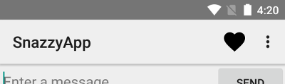

[官方 Adding the App Bar](https://developer.android.com/training/appbar/index.html)

[https://developer.android.com/reference/android/support/v7/app/ActionBar.html](https://developer.android.com/reference/android/support/v7/app/ActionBar.html#setDisplayHomeAsUpEnabled(boolean))

[https://developer.android.com/reference/android/support/v7/widget/Toolbar.html](https://developer.android.com/reference/android/support/v7/widget/Toolbar.html)


[https://developer.android.com/guide/topics/resources/menu-resource.html](https://developer.android.com/guide/topics/resources/menu-resource.html)

>The app bar, also known as the action bar, is one of the most important design elements in your app's activities, because it provides a visual structure and interactive elements that are familiar to users. Using the app bar makes your app consistent with other Android apps, allowing users to quickly understand how to operate your app and have a great experience. The key functions of the app bar are as follows:
>+ A dedicated space for giving your app an identity and indicating the user's location in the app.
>+ Access to important actions in a predictable way, such as search.
>+ Support for navigation and view switching (with tabs or drop-down lists).

应用程序栏，也称为动作栏，是应用程序活动中最重要的设计元素之一，因为它提供了用户熟悉的可视化结构和交互元素。使用应用程序栏使你的应用程序与其他Android应用程序相一致，允许用户快速了解如何操作你的应用程序，并拥有丰富的经验。该应用程序栏的关键功能如下：
+ 一个专用的空间，给你的应用程序一个身份，并指出用户在应用程序中的位置。
+ 以可预测的方式访问重要动作，如搜索。
+ 支持导航和视图切换（带有制表符或下拉列表）。

>This class describes how to use the v7 appcompat support library's Toolbar widget as an app bar. There are other ways to implement an app bar—for example, some themes set up an ActionBar as an app bar by default—but using the appcompat Toolbar makes it easy to set up an app bar that works on the widest range of devices, and also gives you room to customize your app bar later on as your app develops.

本课介绍了如何使用V7 appcompat支持库的工具栏控件作为一个应用程序栏。还有其他的方法来实现例如一个应用程序栏，一些主题设置ActionBar作为默认应用程序栏而使用appcompat工具栏可以很容易建立一个应用程序栏，在最广泛的设备，也让你的房间来定制你的应用程序栏后作为你的应用程序开发。


### Lessons
##### Setting Up the App Bar
+ Learn how to add a Toolbar widget to your activity, and set it as the activity's app bar.
##### Adding and Handling Actions
+ Learn how to add actions to the app bar and its overflow menu, and how to respond when users choose those actions.
##### Adding an Up Action
+ Learn how to add an Up button to your app bar, so users can navigate back to the app's home screen.
##### Action Views and Action Providers
+ Learn how to use these widgets to provide advanced functionality in your app bar.


# Lessons

## Setting Up the App Bar


>In its most basic form, the action bar displays the title for the activity on one side and an overflow menu on the other. Even in this simple form, the app bar provides useful information to the users, and helps to give Android apps a consistent look and feel.

在最基本的形式中，Action Bar 一边显示 Activity 的标题和而另一边显示溢出菜单。即使在这个简单的形式中，应用程序栏也向用户提供有用的信息，并有助于给Android应用程序提供一致的外观和感觉。


Figure 1. An app bar with the app title and overflow menu.

>Beginning with Android 3.0 (API level 11), all activities that use the default theme have an ActionBar as an app bar. However, app bar features have gradually been added to the native ActionBar over various Android releases. As a result, the native ActionBar behaves differently depending on what version of the Android system a device may be using. By contrast, the most recent features are added to the support library's version of Toolbar, and they are available on any device that can use the support library.

起始为Android 3.0（API级别11），所有使用默认的主题活动是有一个actionbar。
然而，应用程序栏也逐渐被添加到本地ActionBar不同的Android版本。因此，本地的ActionBar不同的行为取决于什么版本的Android系统的设备可以使用。相比之下，最新的特性被添加到支持库的工具栏的版本中，并且它们可以在任何可以使用支持库的设备上使用。

>For this reason, you should use the support library's Toolbar class to implement your activities' app bars. Using the support library's toolbar helps ensure that your app will have consistent behavior across the widest range of devices. For example, the Toolbar widget provides a material design experience on devices running Android 2.1 (API level 7) or later, but the native  bar doesn't support material design unless the device is running Android 5.0 (API level 21) or later.

为此，您应该使用支持库的工具栏类来实现活动的应用程序栏。使用支持库的工具栏有助于确保应用程序在最广泛的设备范围内具有一致的行为。例如，工具栏小部件在运行Android 2.1（API 7级）或更高版本的设备上提供了一种材料设计经验，但除非设备运行Android 5（API级别21）或更高版本，否则本地bar不支持材料设计。


#### Add a Toolbar to an Activity

These steps describe how to set up a Toolbar as your activity's app bar:

1. Add the [`v7 appcompat`] support library to your project, as described in [`Support Library Setup`].

2. Make sure the activity extends `AppCompatActivity`:

```java
public class MyActivity extends AppCompatActivity {
  // ...
}
```
>Note: Make this change for every activity in your app that uses a Toolbar as an app bar.


3. In the app manifest, set the `<application>` element to use `one of appcompat's NoActionBar themes`. Using one of these themes `prevents[防止]` the app from using the native ActionBar class to provide the app bar. For example:

```xml
<application
    android:theme="@style/Theme.AppCompat.Light.NoActionBar"/>
```

4. Add a Toolbar to the activity's layout. For example, the following layout code adds a Toolbar and gives it the appearance of floating above the activity:

```xml
<android.support.v7.widget.Toolbar
   android:id="@+id/my_toolbar"
   android:layout_width="match_parent"
   android:layout_height="?attr/actionBarSize"
   android:background="?attr/colorPrimary"
   android:elevation="4dp"
   android:theme="@style/ThemeOverlay.AppCompat.ActionBar"
   app:popupTheme="@style/ThemeOverlay.AppCompat.Light"/>
```
The Material Design specification recommends that app bars have an `elevation[阴影]` of `4 dp`.
Position the toolbar at the top of the activity's layout, since you are using it as an app bar.


5. In the activity's onCreate() method, call the activity's setSupportActionBar() method, and pass the activity's toolbar. This method sets the toolbar as the app bar for the activity. For example:

```java
@Override
protected void onCreate(Bundle savedInstanceState) {
    super.onCreate(savedInstanceState);
    setContentView(R.layout.activity_my);
    Toolbar myToolbar = (Toolbar) findViewById(R.id.my_toolbar);
    setSupportActionBar(myToolbar);
    }
```

Your app now has a basic action bar. By default, the action bar contains just the name of the app and an overflow menu. The options menu initially contains just the Settings item. You can add more actions to the action bar and the overflow menu, as described in `Adding and Handling Actions`.

#### Use App Bar Utility Methods

>Once you set the toolbar as an activity's app bar, you have access to the various utility methods provided by the v7 appcompat support library's ActionBar class. This approach lets you do a number of useful things, like hide and show the app bar.

>To use the ActionBar utility methods, call the activity's getSupportActionBar() method. This method returns a reference to an appcompat ActionBar object. Once you have that reference, you can call any of the ActionBar methods to adjust the app bar. For example, to hide the app bar, call ActionBar.hide().


一旦你设置工具栏作为一个Activity的应用程序栏，你可以通过`V7 appcompat`支持库的`ActionBar类`提供的各种实用方法。这种方法允许你做一些有用的事情，比如隐藏和显示应用程序栏。

使用ActionBar实用方法，调用Activity的`getsupportactionbar()`方法。此方法返回一个`appcompat ActionBar对象`。一旦你的实例，你可以调用任何的ActionBar方法调整应用程序栏。例如，隐藏应用程序栏，叫`ActionBar.hide()`。


## Adding and Handling Actions

>The app bar allows you to add buttons for user actions. This feature lets you put the most important actions for the current context right at the top of the app. For example, a photo browsing app might show share and create album buttons at the top when the user is looking at their photo roll; when the user looks at an individual photo, the app might show crop and filter buttons.

>Space in the app bar is limited. If an app declares more actions than can fit in the app bar, the app bar send the excess actions to an overflow menu. The app can also specify that an action should always be shown in the overflow menu, instead of being displayed on the app bar.

应用程序栏允许你添加用户操作的按钮。此功能允许您将当前上下文中最重要的操作放在应用程序的顶部。例如，一个照片浏览应用程序可能会显示共享和创建相册按钮在顶部时，用户正在查看他们的照片辊；当用户查看一个单独的照片，应用程序可能会显示作物和过滤按钮。

应用程序栏中的空间是有限的。如果一个应用程序声明更多的操作，而不是在应用程序栏合适，应用程序栏将多余的动作发送到溢出菜单。该应用程序还可以指定在溢出菜单中始终显示一个操作，而不是在应用程序栏上显示。


Figure 2. An app bar with a single action button and an overflow menu.

####Add Action Buttons


>All action buttons and other items available in the action overflow are defined in an XML menu resource. To add actions to the action bar, create a new XML file in your project's res/menu/ directory.

>Add an <item> element for each item you want to include in the action bar, as shown in this code example of a menu XML file:


```xml
<menu xmlns:android="http://schemas.android.com/apk/res/android" >

    <!-- "Mark Favorite", should appear as action button if possible -->
    <item
        android:id="@+id/action_favorite"
        android:icon="@drawable/ic_favorite_black_48dp"
        android:title="@string/action_favorite"
        app:showAsAction="ifRoom"/>

    <!-- Settings, should always be in the overflow -->
    <item android:id="@+id/action_settings"
          android:title="@string/action_settings"
          app:showAsAction="never"/>

</menu>
```


>The `app:showAsAction` attribute specifies whether the action should be shown as a button on the app bar. If you set `app:showAsAction="ifRoom"` (as in the example code's favorite action), the action is displayed as a button if there is room in the app bar for it; if there is not enough room, excess actions are sent to the overflow menu. If you set `app:showAsAction="never" `(as in the example code's settings action), the action is always listed in the overflow menu, not displayed in the app bar.


>The system uses the action's icon as the action button if the action is displayed in the app bar. You can find many useful icons on the [Material Icons](https://material.io/icons/) [page](http://google.github.io/material-design-icons/#getting-icons).


>图标资源：https://material.io/icons/


#### Respond to Actions

>When the user selects one of the app bar items, the system calls your `activity`'s `onOptionsItemSelected()` callback method, and passes a MenuItem object to indicate which item was clicked. In your implementation of onOptionsItemSelected(), call the MenuItem.getItemId() method to determine which item was pressed. The ID returned matches the value you declared in the corresponding <item> element's android:id attribute.

>For example, the following code checks to see which action the user selected. If the method does not recognize the user's action, it invokes the superclass method:

```java
@Override
public boolean onOptionsItemSelected(MenuItem item) {
    switch (item.getItemId()) {
        case R.id.action_settings:
            // User chose the "Settings" item, show the app settings UI...
            return true;

        case R.id.action_favorite:
            // User chose the "Favorite" action, mark the current item
            // as a favorite...
            return true;

        default:
            // If we got here, the user's action was not recognized.
            // Invoke the superclass to handle it.
            return super.onOptionsItemSelected(item);

    }
}
```


## Adding an `Up Action`

>Your app should make it easy for users to find their way back to the app's main screen. One simple way to do this is to provide an Up button on the app bar for all activities except the main one. When the user selects the Up button, the app navigates to the parent activity.

>This lesson shows you how to add an Up button to an activity by declaring the activity's parent in the manifest, and enabling the app bar's Up button.

#### Declare a Parent Activity

>To support the up functionality in an activity, you need to declare the activity's parent. You can do this in the app manifest, by setting an `android:parentActivityName` attribute.

>The android:parentActivityName attribute was introduced in Android 4.1 (API level 16). **To support devices with older versions of Android, define a <meta-data> name-value pair, where the name is "`android.support.PARENT_ACTIVITY`" and the value is the name of the parent activity.**

For example, suppose your app has a main activity named MainActivity and a single child activity. The following manifest code declares both activities, and specifies the parent/child relationship:

```xml
<application ... >
    ...

    <!-- The main/home activity (it has no parent activity) -->

    <activity
        android:name="com.example.myfirstapp.MainActivity" ...>
        ...
    </activity>

    <!-- A child of the main activity -->
    <activity
        android:name="com.example.myfirstapp.MyChildActivity"
        android:label="@string/title_activity_child"
        android:parentActivityName="com.example.myfirstapp.MainActivity" >

        <!-- Parent activity meta-data to support 4.0 and lower -->
        <meta-data
            android:name="android.support.PARENT_ACTIVITY"
            android:value="com.example.myfirstapp.MainActivity" />
    </activity>
</application>

```

#### Enable the Up Button

>To enable the Up button for an activity that has a parent activity, call the app bar's setDisplayHomeAsUpEnabled() method. Typically, you would do this when the activity is created. For example, the following onCreate() method sets a Toolbar as the app bar for MyChildActivity, then enables that app bar's Up button:

```java
@Override
protected void onCreate(Bundle savedInstanceState) {
    super.onCreate(savedInstanceState);
    setContentView(R.layout.activity_my_child);

    // my_child_toolbar is defined in the layout file
    Toolbar myChildToolbar =
        (Toolbar) findViewById(R.id.my_child_toolbar);
    setSupportActionBar(myChildToolbar);

    // Get a support ActionBar corresponding to this toolbar
    ActionBar ab = getSupportActionBar();

    // Enable the Up button
    ab.setDisplayHomeAsUpEnabled(true);
}
```

>You do not need to catch the up action in the activity's onOptionsItemSelected() method. Instead, that method should call its superclass, as shown in Respond to Actions. The superclass method responds to the Up selection by navigating to the parent activity, as specified in the app manifest.

你不需要捕捉的行动在活动的onoptionsitemselected()方法。相反，该方法必须调用其基类，如应对措施。父类的方法作出了选择导航到父活动，为应用程序清单的规定。


## Action Views and Action Providers

>The v7 appcompat support library Toolbar provides several different ways for users to interact with your app. Previous lessons described how to define an action, which can be either a button or a menu item. This lesson describes how to add two versatile components:

V7 appcompat支持库工具栏为用户提供与应用程序交互的几种不同的方式。前面的课程描述了如何定义动作，它可以是按钮也可以是菜单项。本课介绍如何添加两个通用组件：


>+ An action view is an action that provides rich functionality within the app bar. For example, a search action view allows the user to type their search text in the app bar, without having to change activities or fragments.

动作视图是在应用程序栏中提供丰富功能的操作。例如，搜索操作视图允许用户在应用程序栏中输入搜索文本，而不必更改活动或片段。

>+ An action provider is an action with its own customized layout. The action initially appears as a button or menu item, but when the user clicks the action, the action provider controls the action's behavior in any way you want to define. For example, the action provider might respond to a click by displaying a menu.

动作提供程序是一个具有自定义布局的操作。动作最初显示为按钮或菜单项，但当用户单击该操作时，动作提供程序以任何您想要定义的方式控制该操作的行为。例如，动作提供程序可以通过显示菜单来响应单击。


>The Android support libraries provide several specialized action view and action provider widgets. For example, the `SearchView` widget implements an `action view` for entering search queries, and the `ShareActionProvider` widget implements an `action provider` for sharing information with other apps. You can also define your own action views and action providers.

Android支持库提供几个专门的动作视图和动作提供程序窗口小部件。例如，该控件实现进入SearchView搜索查询的动作来看，ShareActionProvider 实现了一个行动，提供与其他应用程序共享信息。您还可以定义自己的操作视图和操作提供程序。


#### Add an Action View

>To add an action view, create an <item> element in the toolbar's menu resource, as Add Action Buttons describes. Add one of the following two attributes to the <item> element:
>+ `actionViewClass`: The class of a widget that implements the action.
>+ `actionLayout`: A layout resource describing the action's components.


>Set the showAsAction attribute to either "ifRoom|collapseActionView" or "never|collapseActionView". The collapseActionView flag indicates how to display the widget when the user is not interacting with it: If the widget is on the app bar, the app should display the widget as an icon. If the widget is in the overflow menu, the app should display the widget as a menu item. When the user interacts with the action view, it expands to fill the app bar.

>For example, the following code adds a `SearchView` widget to the app bar:

[SearchView](https://developer.android.com/reference/android/support/v7/widget/SearchView.html)

```xml
<item android:id="@+id/action_search"
     android:title="@string/action_search"
     android:icon="@drawable/ic_search"
     app:showAsAction="ifRoom|collapseActionView"
     app:actionViewClass="android.support.v7.widget.SearchView" />
```
### 自定义SearchView　Widget
>If the user is not interacting with the widget, the app displays the widget as the icon specified by android:icon. (If there is not enough room in the app bar, the app adds the action to the overflow menu.) When the user taps the icon or menu item, the widget expands to fill the toolbar, allowing the user to interact with it.

>If you need to configure the action, do so in your activity's `onCreateOptionsMenu()` callback. You can get the action view's object reference by calling the static `getActionView()` method. For example, the following code gets the object reference for the SearchView widget defined in the previous code example:

```java
@Override
public boolean onCreateOptionsMenu(Menu menu) {
    getMenuInflater().inflate(R.menu.main_activity_actions, menu);

    MenuItem searchItem = menu.findItem(R.id.action_search);
    SearchView searchView =
            (SearchView) MenuItemCompat.getActionView(searchItem);

    // Configure the search info and add any event listeners...

    return super.onCreateOptionsMenu(menu);
}

```

#### Responding to action view expansion

>If the action's <item> element has a collapseActionView flag, the app displays the action view as an icon until the user interacts with the action view. When the user clicks on the icon, the built-in handler for onOptionsItemSelected() expands the action view. If your activity subclass overrides the onOptionsItemSelected() method, your override method must call super.onOptionsItemSelected() so the superclass can expand the action view.

>If you want to do something when the action is expanded or collapsed, you can define a class that implements `MenuItem.OnActionExpandListener`, and pass a member of that class to `setOnActionExpandListener()`. For example, you might want to update the activity based on whether an action view is expanded or collapsed. The following snippet shows how to define and pass a listener:


```java
@Override
public boolean onCreateOptionsMenu(Menu menu) {
    getMenuInflater().inflate(R.menu.options, menu);
    // ...

    // Define the listener
    OnActionExpandListener expandListener = new OnActionExpandListener() {
        @Override
        public boolean onMenuItemActionCollapse(MenuItem item) {
            // Do something when action item collapses
            return true;  // Return true to collapse action view
        }

        @Override
        public boolean onMenuItemActionExpand(MenuItem item) {
            // Do something when expanded
            return true;  // Return true to expand action view
        }
    };

    // Get the MenuItem for the action item
    MenuItem actionMenuItem = menu.findItem(R.id.myActionItem);

    // Assign the listener to that action item
    MenuItemCompat.setOnActionExpandListener(actionMenuItem, expandListener);

    // Any other things you have to do when creating the options menu…

    return true;
}

```

#### Add an Action Provider

>To declare an action provider, create an <item> element in the toolbar's menu resource, as described in Add Action Buttons. Add an actionProviderClass attribute, and set it to the fully qualified class name for the action provider class.

>For example, the following code declares a ShareActionProvider, which is a widget defined in the support library that allows your app to share data with other apps:

```xml
<item android:id="@+id/action_share"
    android:title="@string/share"
    app:showAsAction="ifRoom"
    app:actionProviderClass="android.support.v7.widget.ShareActionProvider"/>
```
>In this case, it is not necessary to declare an icon for the widget, since ShareActionProvider provides its own graphics. If you are using a custom action, declare an icon.

>For information about creating a custom action provider, see the [ActionProvider](https://developer.android.com/reference/android/support/v4/view/ActionProvider.html) reference. For information about configuring a ShareActionProvider, see the reference for that class.


#
