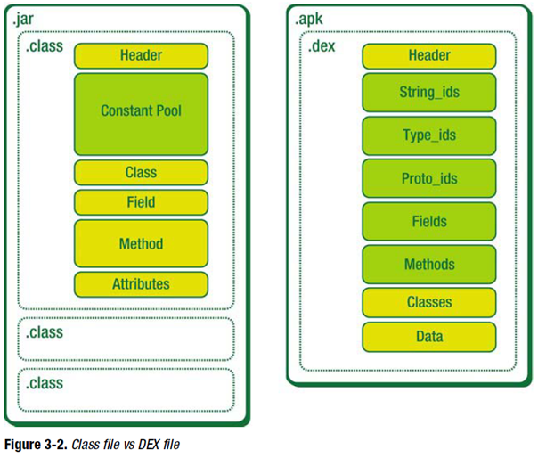

# 使用APKTool反编译apk文件

工具  |  	作用  |  	下载地址
|-----|-----|-------|
ApkTool  |  	Goolge官方提供的APK反编译工具十分强大, 是以下几个工具的综合体 	 |  https://ibotpeaches.github.io/Apktool/install/
dex2jar 	 |  将dex文件转为jar包及.class文件 	 |  https://github.com/pxb1988/dex2jar
baksmali.jar  |  	将Odex文件转为Dex文件 	 |  https://bitbucket.org/JesusFreke/smali/downloads
smali.jar  |  	将.smali文件重新打包转为Dex文件 	 |  https://bitbucket.org/JesusFreke/smali/downloads
JD-GUI  |  	jar\dex.smali源码查看工具（收费及30天试用） 	 |  http://jd-gui-for-linux.apponic.com/download/

## 一 、环境准备

### Quick Check

>Is at least Java 1.7 installed?
>Does executing java -version on command line / command prompt return 1.7 or greater?
>If not, please install Java 7+ and make it the default.

### Installation for Apktool

>**1. Windows**:
>+ Download Windows wrapper script (Right click, Save Link As apktool.bat)
>+ Download apktool-2 (find newest here)
>+ Rename downloaded jar to apktool.jar
>+ Move both files (apktool.jar & apktool.bat) to your Windows directory (Usually C://Windows)
>+ If you do not have access to C://Windows, you may place the two files anywhere then add that directory to your Environment Variables System PATH variable.
>+ Try running apktool via command prompt

>2. **Linux**:
>+ Download Linux wrapper script (Right click, Save Link As apktool)
>+ Download apktool-2 (find newest here)
>+ Rename downloaded jar to apktool.jar
>+ Move both files (apktool.jar & apktool) to /usr/local/bin (root needed)
>+ Make sure both files are executable (chmod +x)
>+ Try running apktool via cli

>3. **Mac OS X**:
>+ Download Mac wrapper script (Right click, Save Link As apktool)
>+ Download apktool-2 (find newest here)
>+ Rename downloaded jar to apktool.jar
>+ Move both files (apktool.jar & apktool) to /usr/local/bin (root needed)
>+ Make sure both files are executable (chmod +x)
>+ Try running apktool via cli

`Note` - Wrapper scripts are not needed, but helpful so you don’t have to type java -jar apktool.jar over and over.

## 二、破解过程

目前你拥有两个文件【可执行文件】：`apktool` 、 `apktool.jar`

### 第一步：获取资源文件

>直接解压获取到`res`目录如果是加壳了的，得到的`xml文件`内容会乱码，`图片可用`。此时用`ApkTool`处理`apktool d -f flyme-res_temp.apk`, 然后会在同级目录生成同名文件夹，xml资源全暴露包括Manifest。

到此,资源文件你就已经获得了资源文件。

### 第二步：拿到dex文件

>什么是dex文件？
>+ 它是Android系统的可执行文件，包含`应用程序的全部操作指令`以及`运行时数据`。
>+ 由于dalvik是一种针对嵌入式设备而特殊设计的java虚拟机，所以dex文件与标准的class文件在结构设计上有着本质的区别。
>+ 当java程序编译成class后，还需要使用dx工具将所有的class文件整合到一个dex文件，目的是其中各个类能够共享数据，在一定程度上降低了冗余，同时也是文件结构更加经凑，实验表明，dex文件是传统jar文件大小的50%左右。
>
>**dex将原来class每个文件都有的共有信息合成一体，这样减少了class的冗余。**
> 博客推荐： [Dex文件格式详解](http://blog.csdn.net/woblog/article/details/52106546)

直接解压【我这里可以】或者 Apktool反编译可以获得。

>smali文件中可以得到java文件的信息，对于高手smali文件就可以看出很多东西了，具体请google **smali语法**

此时需要将.smali文件重新打包成jar或是dex，执行java -jar smali.jar as out/，该指令是讲将out目录下的smali文件重新打包回dex文件，会生成名为out.dex的文件

#
