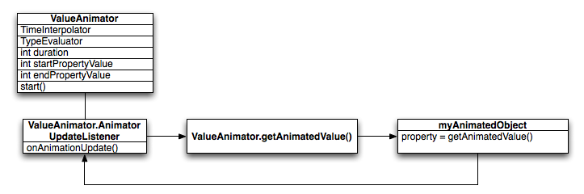

`3.0以前`，android支持两种动画模式，`tween animation`,`frame animation`，在android3.0中又引入了一个新的动画系统：`property animation`，`这三种动画模式在SDK中被称为property animation,view animation,drawable animation。` 可通过NineOldAndroids项目在3.0之前的系统中使用Property Animation.

## 1. View Animation（Tween Animation）
### 什么是？
`View Animation（Tween Animation）`：`补间动画`，给出两个关键帧，通过一些算法将给定属性值在给定的时间内在两个关键帧间渐变。

V0iew animation只能应用于View对象，而且只支持一部分属性，如支持缩放旋转而不支持背景颜色的改变。

**而且对于View animation，它`只是改变了View对象绘制的位置`，`而没有改变View对象本身`.**
>比如，你有一个Button，坐标（100,100），Width:200,Height:50，而你有一个动画使其变为Width：100，Height：100，你会发现动画过程中触发按钮点击的区域仍是(100,100)-(300,150)。

`View Animation`就是一系列`View形状`的变换，如`大小的缩放`，`透明度的改变`，`位置的改变`，动画的定义既可以`用代码定义`也可以`用XML定义`，当然，建议用XML定义。


可以给`一个View同时设置多个动画`，比如从透明至不透明的淡入效果，与从小到大的放大效果，这些动画可以同时进行，也可以在一个完成之后开始另一个。

用XML定义的动画放在`/res/anim/`文件夹内，XML文件的根元素可以为`<alpha>`,`<scale>`, `<translate>`,` <rotate >`,`interpolator元素或``<set>`(表示以上几个动画的集合，set可以嵌套)。默认情况下，所有动画是同时进行的，可以通过`startOffset属性`设置各个动画的开始偏移（开始时间）来达到动画顺序播放的效果。

可以通过设置`interpolator`属性改变`动画渐变`的方式，如AccelerateInterpolator，开始时慢，然后逐渐加快。`默认为AccelerateDecelerateInterpolator。`


```java
ImageView spaceshipImage = (ImageView)findViewById(R.id.spaceshipImage);
Animation hyperspaceJumpAnimation=AnimationUtils.loadAnimation(this, R.anim.hyperspace_jump);
spaceshipImage.startAnimation(hyperspaceJumpAnimation);
```


## 2. Drawable Animation（Frame Animation）


### 什么是？

`Drawable Animation`（`Frame Animation`）：`帧动画`，就像GIF图片，通过一系列Drawable依次显示来模拟动画的效果。

在XML中的定义方式如下：
```xml
<animation-list xmlns:android="http://schemas.android.com/apk/res/android"
    android:oneshot="true">
    <item android:drawable="@drawable/rocket_thrust1" android:duration="200" />
    <item android:drawable="@drawable/rocket_thrust2" android:duration="200" />
    <item android:drawable="@drawable/rocket_thrust3" android:duration="200" />
</animation-list>
```

必须以<animation-list>为根元素，以<item>表示要轮换显示的图片，duration属性表示各项显示的时间。XML文件要放在`/res/drawable/目录`下。示例：


>注意：
>+ 要在代码中调用Imageview的setBackgroundResource方法，如果直接在XML布局文件中设置其src属性当触发动画时会FC。
>+ 在动画start()之前要先stop()，不然在第一次动画之后会停在最后一帧，这样动画就只会触发一次。
>+ 最后一点是SDK中提到的，不要在onCreate中调用start，因为AnimationDrawable还没有完全跟Window相关联，如果想要界面显示时就开始动画的话，可以在onWindowFoucsChanged()中调用start()。


## 3. Property Animation

###什么是？

`属性动画`，这个是在Android 3.0中才引进的，以前学WPF时里面的动画机制好像就是这个，**它更改的是对象的实际属性**，在View Animation（Tween Animation）中，其改变的是View的绘制效果，真正的View的属性保持不变，比如无论你在对话中如何缩放Button的大小，Button的有效点击区域还是没有应用动画时的区域，其位置与大小都不变。而 **在Property Animation中，改变的是对象的实际属性**，如Button的缩放，Button的位置与大小属性值都改变了。而且**Property Animation不止可以应用于View，还可以应用于任何对象。Property Animation只是表示一个值在一段时间内的改变，当值改变时要做什么事情完全是你自己决定的。**


>在Property Animation中，可以对动画应用以下属性：
>+ Duration：动画的持续时间
>+ TimeInterpolation：属性值的计算方式，如先快后慢
>+ TypeEvaluator：根据属性的开始、结束值与TimeInterpolation计算出的因子计算出当前时间的属性值
>+ Repeat Count and behavoir：重复次数与方式，如播放3次、5次、无限循环，可以此动画一直重复，或播放完时再反向播放
>+ Animation sets：动画集合，即可以同时对一个对象应用几个动画，这些动画可以同时播放也可以对不同动画设置不同开始偏移
>+ Frame refreash delay：多少时间刷新一次，即每隔多少时间计算一次属性值，默认为10ms，最终刷新时间还受系统进程调度与硬件的影响




`ValueAnimator`  表示一个动画，包含动画的开始值，结束值，持续时间等属性。

ValueAnimator封装了一个`TimeInterpolator`，TimeInterpolator定义了属性值在开始值与结束值之间的插值方法。

ValueAnimator还封装了一个`TypeAnimator`，根据开始、结束值与TimeIniterpolator计算得到的值计算出属性值。

ValueAnimator根据动画已进行的时间跟动画总时间（duration）的比计算出一个时间因子（0~1），然后根据TimeInterpolator计算出另一个因子，最后TypeAnimator通过这个因子计算出属性值


#
