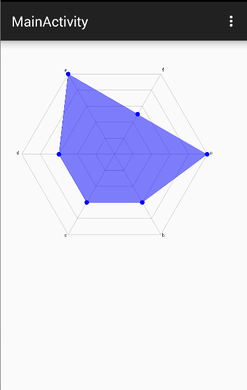

**第1组**: `moveTo`、`setLastPoint`、 `lineTo` 和 `close`

**第2组**: `addXxx`与`arcTo`

```java
    // 圆形
    public void addCircle (float x, float y, float radius, Path.Direction dir)
    // 椭圆
    public void addOval (RectF oval, Path.Direction dir)
    // 矩形
    public void addRect (float left, float top, float right, float bottom, Path.Direction dir)
    public void addRect (RectF rect, Path.Direction dir)
    // 圆角矩形
    public void addRoundRect (RectF rect, float[] radii, Path.Direction dir)
    public void addRoundRect (RectF rect, float rx, float ry, Path.Direction dir)
```

>在path中添加一个基本形状，基本形状部分和前面所讲的绘制基本形状并无太大差别

仔细观察一下第一类是方法，无一例外，在最后都有一个`Path.Direction`，这是一个什么神奇的东东？

Direction的意思是 方向，趋势。 点进去看一下会发现Direction是一个枚举(Enum)类型，里面只有两个枚举常量，如下：

类型|解释|翻译
|:---:|:----:|:--:|
CW | clockwise | 顺时针
CCW | counter-clockwise |	逆时针


序号 | 作用
|:----:|:----:|
1 |	在添加图形时确定闭合顺序(各个点的记录顺序)
2 |	对图形的渲染结果有影响(是判断图形渲染的重要条件)


### 第二类(Path)

```java
// 第二类(Path)
    // path
    public void addPath (Path src)
    public void addPath (Path src, float dx, float dy)
    public void addPath (Path src, Matrix matrix)
```

这个相对比较简单，也很容易理解，就是将两个Path合并成为一个。

第三个方法是将src添加到当前path之前先使用Matrix进行变换。

第二个方法比第一个方法多出来的两个参数是将src进行了位移之后再添加进当前path中。


### 第三类(addArc与arcTo)

```java
// 第三类(addArc与arcTo)
    // addArc
    public void addArc (RectF oval, float startAngle, float sweepAngle)
    // arcTo
    public void arcTo (RectF oval, float startAngle, float sweepAngle)
    public void arcTo (RectF oval, float startAngle, float sweepAngle, boolean forceMoveTo)
```

从名字就可以看出，这两个方法都是与圆弧相关的，作用都是添加一个圆弧到path中，但既然存在两个方法，两者之间肯定是有区别的：


名称|作用|区别
|:----:|:----:|:---:|
addArc |	添加一个圆弧到path |	直接添加一个圆弧到path中
arcTo |	添加一个圆弧到path |	添加一个圆弧到path，如果圆弧的起点和上次最后一个坐标点不相同，就连接两个点


作业：
[Android雷达图(蜘蛛网图)绘制 ](http://blog.csdn.net/crazy__chen/article/details/50163693)




#
