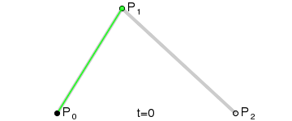

## Path之贝赛尔曲线

`贝塞尔曲线`奠定了`计算机绘图的基础`(**因为它可以将任何复杂的图形用精确的数学语言进行描述**)，在你不经意间就已经使用过它了。

>贝塞尔曲线作用十分广泛，简单举几个的栗子:
>+ QQ小红点拖拽效果
>+ 一些炫酷的下拉刷新控件
>+ 阅读软件的翻书效果
>+ 一些平滑的折线图的制作
>+ 很多炫酷的动画效果

>如何轻松入门贝塞尔曲线？
>+ 科普型(只是让人了解贝塞尔，并没有实质性的内容)
>+ 装逼型(摆出来一大堆公式，引用一堆英文原文)
>+ 基础型(仅仅是讲解贝塞尔曲线的两个函数用法)
>+ 实战型(根据实例讲解其中贝塞尔曲线的运用)

**贝塞尔曲线是用一系列点来控制曲线状态的，我将这些点简单分为两类:**

|类型	|作用|
|----|----|
数据点	|确定曲线的起始和结束位置
控制点	|确定曲线的弯曲程度

### 一阶曲线原理

一阶曲线是没有控制点的，仅有两个数据点(A 和 B)，最终效果一个线段。

### 二阶曲线原理

二阶曲线由两个数据点(A 和 C)，一个控制点(B)来描述曲线状态，大致如下：

连接DE，取点F，使得:

这样获取到的点F就是贝塞尔曲线上的一个点，动态过程如下：

>二阶曲线对应的方法是quadTo

### 三阶曲线原理

**三阶曲线由两个数据点(A 和 D)，两个控制点(B 和 C)来描述曲线状态**

>三阶曲线对应的方法是cubicTo

### 控制点动态移动的效果图

首先，`两个数据点是控制贝塞尔曲线开始和结束的位置`，比较容易理解，`而控制点则是控制贝塞尔的弯曲状态`.

>为了更加容易看出控制点与曲线弯曲程度的关系，上图中绘制出了辅助点和辅助线，从上面的动态图可以看出，贝塞尔曲线在动态变化过程中`有类似于橡皮筋一样的弹性效果`，因此在制作一些`弹性效果`的时候很常用。

**降阶与升阶**

类型	|释义	|变化
|---|---|---|
降阶	|在保持曲线形状与方向不变的情况下，减少控制点数量，即降低曲线阶数	|方法变得简单，数据点变多，控制点可能减少，灵活性变弱
升阶	|在保持曲线形状与方向不变的情况下，增加控制点数量，即升高曲线阶数	|方法更加复杂，数据点不变，控制点增加，灵活性变强

## 贝塞尔曲线使用实例

在制作这个实例之前，首先要明确一个内容，就是在什么情况下需要使用贝塞尔曲线？

序号	|内容	|用例
|---|---|--- |
1	|事先不知道曲线状态，需要实时计算时	|天气预报气温变化的平滑折线图
2	|显示状态会根据用户操作改变时	|QQ小红点，仿真翻书效果
3	|一些比较复杂的运动状态(配合PathMeasure使用)	|复杂运动状态的动画效果

**至于只需要一个静态的曲线图形的情况，用图片岂不是更好，大量的计算会很不划算。**

## 核心难点：

### 1.如何得到数据点和控制点的位置？

关于使用绘制圆形的数据点与控制点早就已经有人详细的计算好了，可以参考stackoverflow的一个回答How to create circle with Bézier curves?其中的数据只需要拿来用即可。

而对于心形的数据点和控制点，可以由圆形的部分数据点和控制点平移后得到，具体参数可以自己慢慢调整到一个满意的效果。

### 2.如何达到渐变效果？

渐变其实就是每次对数据点和控制点稍微移动一点，然后重绘界面，在短时间多次的调整数据点与控制点，使其逐渐接近目标值，通过不断的重绘界面达到一种渐变的效果。过程可以参照下图动态效果：

#
