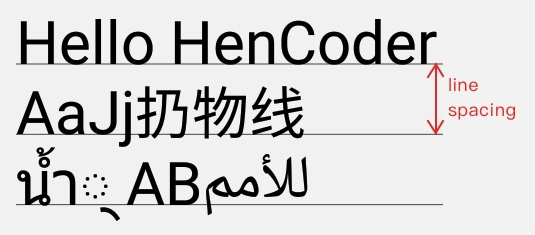

# Canvas 绘制文字的方式

>Canvas 的文字绘制方法有三个：`drawText()` `drawTextRun()` 和 `drawTextOnPath()`。

##### 1.1 drawText(String text, float x, float y, Paint paint)

+ `drawText()` 是 `Canvas` 最基本的绘制文字的方法：给出文字的内容和位置， Canvas 按要求去绘制文字。

canvas.drawText(text, 200, 100, paint);  

方法的参数很简单： `text 是文字内容`，`x 和 y 是文字的坐标`。但需要注意：这个坐标并不是文字的左上角，而是一个与左下角比较接近的位置。大概在这里：


**这是为什么？为什么其它的 Canvas.drawXXX() 方法，都是以左上角作为基准点的，而 drawText() 却是文字左下方？**

先别觉得日了狗，这种设计其实是有道理的。drawText() 参数中的 y ，指的是文字的基线（ baseline ） 的位置。也就是这条线：


##### 1.2 drawTextRun()

对中文没有影响,略过

##### 1.3 drawTextOnPath()

沿着一条 Path 来绘制文字。这是一个耍杂技的方法。

```java
canvas.drawPath(path, paint); // 把 Path 也绘制出来，理解起来更方便  
canvas.drawTextOnPath("Hello HeCoder", path, 0, 0, paint);  
```

>吁，拐角处的文字怎么那么难看？所以记住一条原则： `drawTextOnPath() 使用的 Path ，拐弯处全用圆角，别用尖角。`

```java
drawTextOnPath(String text, Path path, float hOffset, float vOffset, Paint paint)
```

参数里，需要解释的只有两个： `hOffset 和 vOffset`。它们是文字相对于 Path 的水平偏移量和竖直偏移量，利用它们可以调整文字的位置。例如你设置 hOffset 为 5， vOffset 为 10，文字就会右移 5 像素和下移 10 像素。


##### 1.4 StaticLayout

这个也是使用 Canvas 来进行文字的绘制，不过并不是使用 Canvas 的方法。

`Canvas.drawText()` 只能绘制`单行的文字`，`而不能换行`,
不能在 View 的边缘自动折行.`到了 View 的边缘处，文字继续向后绘制到看不见的地方，而不是自动换行.`

**如果需要绘制多行的文字，你必须自行把文字切断后分多次使用 drawText() 来绘制，或者——使用 `StaticLayout` 。**

`StaticLayout` 并不是一个 `View` 或者 `ViewGroup` ，而是 `android.text.Layout 的子类`，它是纯粹用来绘制文字的。 StaticLayout 支持换行，它既可以为文字设置宽度上限来让文字自动换行，也会在 \n 处主动换行。

>`StaticLayout` 的构造方法是 `StaticLayout(CharSequence source, TextPaint paint, int width, Layout.Alignment align, float spacingmult, float spacingadd, boolean includepad)`，其中参数里：

+ `width` 是文字区域的宽度，文字到达这个宽度后就会自动换行；
+ `align` 是文字的对齐方向；
+ `spacingmult` 是行间距的倍数，通常情况下填 1 就好；
+ `spacingadd` 是行间距的额外增加值，通常情况下填 0 就好；
+ `includeadd` 是指是否在文字上下添加额外的空间，来避免某些过高的字符的绘制出现越界。

如果你需要进行多行文字的绘制，并且对文字的排列和样式没有太复杂的花式要求，那么使用 StaticLayout 就好。


# Paint 对文字绘制的辅助

`Paint` 对文字绘制的辅助，有两类方法：`设置显示效果`的和`测量文字尺寸`的。

#### 2.1 设置显示效果类

##### 2.1.1 setTextSize(float textSize)

设置文字大小。

#####　2.1.2 setTypeface(Typeface typeface)

设置字体。

```java
paint.setTypeface(Typeface.DEFAULT);  
canvas.drawText(text, 100, 150, paint);  
paint.setTypeface(Typeface.SERIF);  
canvas.drawText(text, 100, 300, paint);  
paint.setTypeface(Typeface.createFromAsset(getContext().getAssets(), "Satisfy-Regular.ttf"));  
canvas.drawText(text, 100, 450, paint);  
```

设置不同的 `Typeface` 就可以显示不同的字体。我们中国人谈到「字体」，比较熟悉的词是 `font，` `typeface` 和 `font` 是一个意思，都表示`字体`。 Typeface 这个类的具体用法，需要了解的话可以[直接看文档](https://developer.android.com/reference/android/graphics/Typeface.html)，很简单。


##### 2.1.3 setFakeBoldText(boolean fakeBoldText)

是否使用伪粗体。

之所以叫伪粗体（ fake bold ），因为它并不是通过选用更高 weight 的字体让文字变粗，而是通过程序在运行时把文字给「描粗」了。

```java
paint.setFakeBoldText(false);  
canvas.drawText(text, 100, 150, paint);  
paint.setFakeBoldText(true);  
canvas.drawText(text, 100, 230, paint);  
```

##### 2.1.4 setStrikeThruText(boolean strikeThruText)

是否加删除线

##### 2.1.5 setUnderlineText(boolean underlineText)

是否加下划线

##### 2.1.6 setTextSkewX(float skewX)

设置文字横向错切角度。其实就是文字倾斜度的啦。

```java
paint.setTextSkewX(-0.5f);  
canvas.drawText(text, 100, 150, paint);  
```

##### 2.1.7 setTextScaleX(float scaleX)

设置文字横向放缩。也就是文字变胖变瘦。

```java
paint.setTextScaleX(1);  
canvas.drawText(text, 100, 150, paint);  
paint.setTextScaleX(0.8f);  
canvas.drawText(text, 100, 230, paint);  
paint.setTextScaleX(1.2f);  
canvas.drawText(text, 100, 310, paint);  
```

##### 2.1.8 setLetterSpacing(float letterSpacing)

设置字符间距。默认值是 0。

```java
paint.setLetterSpacing(0.2f);  
canvas.drawText(text, 100, 150, paint);  
```

##### 2.1.10 setTextAlign(Paint.Align align)

设置文字的对齐方式。一共有三个值：LEFT CETNER 和 RIGHT。默认值为 LEFT。

##### 2.1.11 setTextLocale(Locale locale) / setTextLocales(LocaleList locales)


##### 2.1.12 setHinting(int mode)

设置是否启用字体的 `hinting` （字体微调）。

现在的 Android 设备大多数都是是用的`矢量字体`。矢量字体的`原理是对每个字体给出一个字形的矢量描述`，然后使用这一个矢量来对所有的尺寸的字体来生成对应的字形。由于不必为所有字号都设计它们的字体形状，所以在字号较大的时候，矢量字体也能够保持字体的圆润，这是矢量字体的优势。不过当文字的尺寸过小（比如高度小于 16 像素），有些文字会由于失去过多细节而变得不太好看。 hinting 技术就是为了解决这种问题的：通过向字体中加入 hinting 信息，让矢量字体在尺寸过小的时候得到针对性的修正，从而提高显示效果。效果图盗一张维基百科的：

##### 2.1.14 setSubpixelText(boolean subpixelText)

是否开启次像素级的抗锯齿（ sub-pixel anti-aliasing ）。


#### 2.2 测量文字尺寸类

不论是文字，还是图形或 Bitmap，只有知道了尺寸，才能更好地确定应该摆放的位置。由于文字的绘制和图形或 Bitmap 的绘制比起来，尺寸的计算复杂得多，所以它有一整套的方法来计算文字尺寸。


##### 2.2.1 float getFontSpacing()

获取推荐的行距。

即推荐的两行文字的 baseline 的距离。这个值是系统根据文字的字体和字号自动计算的。它的作用是当你要手动绘制多行文字（而不是使用 StaticLayout）的时候，可以在换行的时候给 y 坐标加上这个值来下移文字。

```java
canvas.drawText(texts[0], 100, 150, paint);  
canvas.drawText(texts[1], 100, 150 + paint.getFontSpacing, paint);  
canvas.drawText(texts[2], 100, 150 + paint.getFontSpacing * 2, paint);
```



##### 2.2.2 FontMetircs getFontMetrics()

获取 Paint 的 FontMetrics。

FontMetrics 是个相对专业的工具类，它提供了几个文字排印方面的数值：ascent, descent, top, bottom, leading。


如图，图中有两行文字，每一行都有 5 条线：top, ascent, baseline, descent, bottom。（leading 并没有画出来，因为画不出来，下面会给出解释）

##### 2.2.3 getTextBounds(String text, int start, int end, Rect bounds)

获取文字的显示范围。

参数里，text 是要测量的文字，start 和 end 分别是文字的起始和结束位置，bounds 是存储文字显示范围的对象，方法在测算完成之后会把结果写进 bounds。

```java
paint.setStyle(Paint.Style.FILL);  
canvas.drawText(text, offsetX, offsetY, paint);

paint.getTextBounds(text, 0, text.length(), bounds);  
bounds.left += offsetX;  
bounds.top += offsetY;  
bounds.right += offsetX;  
bounds.bottom += offsetY;  
paint.setStyle(Paint.Style.STROKE);  
canvas.drawRect(bounds, paint);  
```

##### 2.2.4 float measureText(String text)

测量文字的宽度并返回。

```java
canvas.drawText(text, offsetX, offsetY, paint);  
float textWidth = paint.measureText(text);  
canvas.drawLine(offsetX, offsetY, offsetX + textWidth, offsetY, paint);  
```


#
