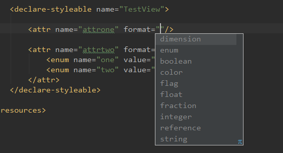

## 如何自定义属性
**在`res/values`中的`attrs.xml`中自定义属性。**

```xml
<declare-styleable name="TestView">
  <attr name="attrone" format="dimension"/>
  <attr name="attrtwo" format="string" >
    <enum name="one" value="0"/>
    <enum name="two" value="1"/>
  </attr>
</declare-styleable>
```
分析一下以上代码代表的含义：

`declare-styleable`： 表示一个属性组。它的`name`必须和你`自定义view`的名字相同

`attr`：表示单独的一个属性。`format`代表属性的格式。格式包括很多种：比如颜色，数值，枚举等。 看下图：



`源码中layout_width的attr就能明白定义的默认值了。`
```xml
<declare-styleable name="ViewGroup_Layout">
  <attr name="layout_width" format="dimension">
      <enum name="fill_parent" value="-1" />
      <enum name="match_parent" value="-1" />
      <enum name="wrap_content" value="-2" />
  </attr>
</declare-styleable>
```

## 如何使用自定义属性？
首先加入命名空间：

> xmlns:app="http://schemas.android.com/apk/res-auto"

Android自定义控件的属性，在xml中使用自己自定义的attr的时候，其中有一步就是要自定义一个xml的命名空间后然后再给自定义属性赋值，现在发现不知道什么时候开始Android把这个改了，现在发现可以统一用

>xmlns:app="http://schemas.android.com/apk/res-auto"

而不是原来的:

>xmlns:app="http://schemas.android.com/apk/App的Package名"

还有人提到在作为lib被使用的时候，也应该用res-auto

所以说区别就是如果你http://schemas.android.com/apk/后面写的是res/包名，那就是相关包名下的自定义属性，而res-auto就是所有的自定义包名。


```xml
<com.mg.axe.androiddevelop.view.TestView
    android:layout_width="match_parent"
    android:layout_height="match_parent"
    app:attrone="10dp" app:attrtwo="two" />
```

## 如何获取自定义属性？
  `通过getContext`().`obtainStyledAttributes`()`获取TypedArray，`
通过TypedArray来获取自定义属性的值。上代码：


V#
