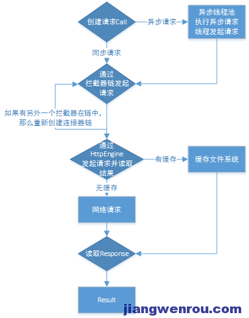

[Okhttp缓存浅析](http://www.jiangwenrou.com/okhttp%E7%BC%93%E5%AD%98%E6%B5%85%E6%9E%90.html)



### 拦截器Interceptors

先来看看Interceptor本身的文档解释：观察，修改以及可能短路的请求输出和响应请求的回来。通常情况下拦截器用来添加，移除或者转换请求或者回应的头部信息。 拦截器接口中有intercept(Chain chain)方法，同时返回Response。这里有一个简单的拦截弹，它记录了即将到来的请求和输入的响应。

```java
class LoggingInterceptor implements Interceptor {
  @Override public Response intercept(Chain chain) throws IOException {
    Request request = chain.request();

    long t1 = System.nanoTime();
    logger.info(String.format("Sending request %s on %s%n%s",
        request.url(), chain.connection(), request.headers()));

    Response response = chain.proceed(request);

    long t2 = System.nanoTime();
    logger.info(String.format("Received response for %s in %.1fms%n%s",
        response.request().url(), (t2 - t1) / 1e6d, response.headers()));

    return response;
  }
}
```

chain.proceed(request)是拦截器的关键部分。这个看似简单的方法是所有的HTTP工作发生的地方，产生满足要求的反应。 拦截器可以链接。假设你有一个压缩的拦截和校验拦截器：你需要决定数据是否被压缩，或者校验或校验然后压缩。okhttp使用列表来跟踪和拦截，拦截器会按顺序调用


###
