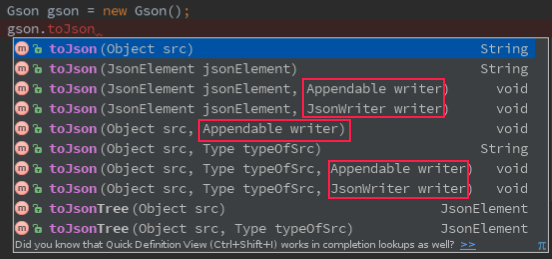

[TOC]


本次的主要内容：

+ Gson的流式反序列化
+ Gson的流式序列化
+ 使用GsonBuilder导出null值、格式化输出、日期时间及其它小功能


## 一、Gson的流式反序列化

**自动方式**

> Gson提供了fromJson()和toJson() 两个直接用于解析和生成的方法，前者实现反序列化，后者实现了序列化。同时每个方法都提供了重载方法，常用的总共有5个.
>+ Gson.toJson(Object);
>+ Gson.fromJson(Reader,Class);
>+ Gson.fromJson(String,Class);
>+ Gson.fromJson(Reader,Type);
>+ Gson.fromJson(String,Type);


**手动方式**

>手动的方式就是使用`stream`包下的`JsonReader`类来手动实现反序列化，和Android中使用pull解析XML是比较类似的。


```java
String json = "{\"name\":\"怪盗kidou\",\"age\":\"24\"}";
User user = new User();
JsonReader reader = new JsonReader(new StringReader(json));
reader.beginObject(); // throws IOException
while (reader.hasNext()) {
    String s = reader.nextName();
    switch (s) {
        case "name":
            user.name = reader.nextString();
            break;
        case "age":
            user.age = reader.nextInt(); //自动转换
            break;
        case "email":
            user.email = reader.nextString();
            break;
    }
}
reader.endObject(); // throws IOException
System.out.println(user.name);  // 怪盗kidou
System.out.println(user.age);   // 24
System.out.println(user.email); // ikidou@example.com
```

>其实自动方式最终都是通过JsonReader来实现的，如果第一个参数是String类型，那么Gson会创建一个StringReader转换成流操作。


## 二、Gson的流式序列化

**自动方式**



>提示：PrintStream(System.out) 、StringBuilder、StringBuffer和*Writer都实现了Appendable接口。

**手动方式**

```java
JsonWriter writer = new JsonWriter(new OutputStreamWriter(System.out));
writer.beginObject() // throws IOException
        .name("name").value("怪盗kidou")
        .name("age").value(24)
        .name("email").nullValue() //演示null
        .endObject(); // throws IOException
writer.flush(); // throws IOException
//{"name":"怪盗kidou","age":24,"email":null}

```

>提示：除了beginObject、endObject还有beginArray和endArray，两者可以相互嵌套，注意配对即可。beginArray后不可以调用name方法，同样beginObject后在调用value之前必须要调用name方法。


## 三、 使用GsonBuilder导出null值、格式化输出、日期时间


>一般情况下Gson类提供的 API已经能满足大部分的使用场景，但我们需要更多更特殊、更强大的功能时，这时候就引入一个新的类 `GsonBuilder`。


**GsonBuilder**从名上也能知道是用于构建Gson实例的一个类，**要想改变Gson默认的设置必须使用该类配置Gson**。

**GsonBuilder用法**

```java
Gson gson = new GsonBuilder()
               //各种配置
               .create(); //生成配置好的Gson
```

**配置举例：Gson在默认情况下是不动导出值null的键的，如：**

```java
public class User {
    //省略其它
    public String name;
    public int age;
    public String email;
}
```

```java
Gson gson = new Gson();
User user = new User("怪盗kidou",24);
System.out.println(gson.toJson(user)); //{"name":"怪盗kidou","age":24}
```

>可以看出，email字段是没有在json中出现的，当我们在调试是、需要导出完整的json串时或API接中要求没有值必须用Null时，就会比较有用。

**配置：**

```java
Gson gson = new GsonBuilder()
        .serializeNulls()
        .create();
User user = new User("怪盗kidou", 24);
System.out.println(gson.toJson(user)); //{"name":"怪盗kidou","age":24,"email":null}
```

**格式化输出、日期时间及其它：**

```java
Gson gson = new GsonBuilder()
        //序列化null
        .serializeNulls()
        // 设置日期时间格式，另有2个重载方法
        // 在序列化和反序化时均生效
        .setDateFormat("yyyy-MM-dd")
        // 禁此序列化内部类
        .disableInnerClassSerialization()
        //生成不可执行的Json（多了 )]} 这4个字符）
        .generateNonExecutableJson()
        //禁止转义html标签
        .disableHtmlEscaping()
        //格式化输出
        .setPrettyPrinting()
        .create();
```

>内部类(Inner Class)和嵌套类(Nested Class)的区别


#
