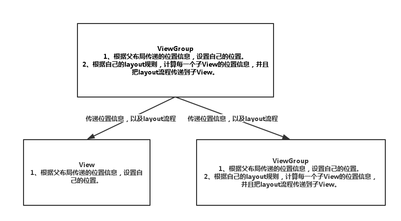
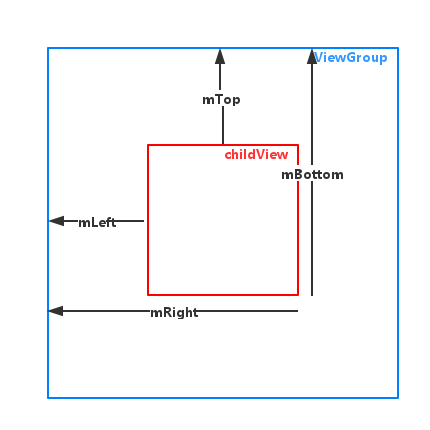

[Android View框架的layout机制](http://www.cnblogs.com/xyhuangjinfu/p/5435253.html)

### 带着问题来思考整个layout过程。

#### 1、系统为什么要有layout过程？

View框架在经过第一步的measure过程后，成功计算了每一个View的尺寸。但是要成功的把View绘制到屏幕上，只有View的尺寸还不行，还需要准确的知道该View应该被绘制到什么位置。除此之外，对一个ViewGroup而言，还需要根据自己特定的layout规则，来正确的计算出子View的绘制位置，已达到正确的layout目的。这也就是layout过程的职责。

该位置是View相对于父布局坐标系的相对位置，而不是以屏幕坐标系为准的绝对位置。这样更容易保持树型结构的递归性和内部自治性。而View的位置，可以无限大，超出当前ViewGroup的可视范围，这也是通过改变View位置而实现滑动效果的原理。

#### 2、layout过程都干了点什么事？

由于View是以树结构进行存储，所以典型的数据操作就是递归操作，所以，View框架中，采用了内部自治的layout过程。

每个叶子节点根据父节点传递过来的位置信息，设置自己的位置数据，每个非叶子节点，除了负责根据父节点传递过来的位置信息，设置自己的位置数据外（如果有父节点的话），还需要根据自己内部的`layout`规则（比如垂直排布等），计算出每一个子节点的位置信息，然后向子节点传递layout过程。

对于`ViewGroup`，除了根据自己的`parent`传递的位置信息，来设置自己的位置之外，还需要根据自己的`layout规则`，为每一个子View计算出准确的位置（相对于子View的父布局的位置）。

对于`View`，根据自己的`parent`传递的位置信息，来设置自己的位置。



View对象的位置信息，在内部是以`4`个成员变量的保存的，分别是`mLeft`、`mRight`、`mTop`、`mBottom`。他们的含义如图所示。




## 源代码分析

我们知道，整棵`View`树的根节点是`DecorView`，它是一个`FrameLayout`，所以它是一个`ViewGroup`，所以整棵`View`树的测量是从一个`ViewGroup`对象的`layout`方法开始的


### View的方法

#### layout()方法

分配一个位置信息到一个View上面，每个parent会调用children的layout方法来设置children的位置。**最好不要覆写该方法，有children的viewGroup，应该覆写`onLayout`方法**

###＃　onLayout()方法

根据布局规则，计算每一个子View的位置，View类默认是空实现。 所以这里没有源代码


### ViewGroup的方法

#### onLayout()方法
ViewGroup中，只需要覆写onLayout方法，来计算出每一个子View的位置，并且把layout流程传递给子View。

伪代码：

```java
protected void onLayout(boolean changed, int l, int t, int r, int b) {
    for (遍历子View) {
        /**
        根据如下数据计算。
            1、自己当前布局规则。比如垂直排放或者水平排放。
            2、子View的测量尺寸。
            3、子View在所有子View中的位置。比如位置索引，第一个或者第二个等。
        */
        计算每一个子View的位置信息;

        child.layout(上面计算出来的位置信息);
    }        
}
复制代码


```

### 结论：
>**一般来说，自定义View，如果该View不包含子View，类似于TextView这种的，是不需要覆写onLayout方法的。而含有子View的，比如LinearLayout这种，就需要根据自己的布局规则，来计算每一个子View的位置。**


#
